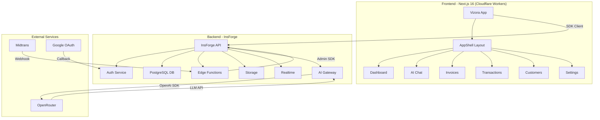

<div align="center">

<p align="center">
  
</p>
# Vizora Capital

### Clearer finances, smarter decisions.

Build a tighter cash flow without losing control. Vizora Capital brings invoice management, transaction tracking, and an AI finance assistant into one secure workspace — every AI action requires human approval before any data actually changes.

```
✦ Multi-tenant & role-based  —  One isolated workspace per business, with administrator, approver, finance, and viewer access controls.
✦ Invoice lifecycle          —  Create, approve, send, track payments, and auto-send overdue reminders.
✦ AI finance assistant       —  Ask anything about your business finances; AI produces drafts you can review, edit, or reject.
✦ Realtime updates           —  Data changes appear instantly across all team members — no refresh needed.
✦ Full audit trail           —  Every change is logged: who, when, and what — including AI actions.
✦ Subscription billing       —  Midtrans checkout with signed webhook verification and double-check status confirmation.
```

[](LICENSE)
[](https://github.com/vizartid/Vizora-Capital)
[](https://github.com/vizartid/Vizora-Capital)
[](https://github.com/vizartid/Vizora-Capital)

<br>

### Tech Stack

<a href="https://nextjs.org">
  
</a>
<a href="https://react.dev">
  
</a>
<a href="https://www.typescriptlang.org">
  
</a>
<a href="https://tailwindcss.com">
  
</a>
<a href="https://insforge.dev">
  
</a>
<a href="https://orm.drizzle.team">
  
</a>
<a href="https://www.postgresql.org">
  
</a>
<a href="https://openai.com">
  
</a>
<a href="https://www.midtrans.com">
  
</a>
<a href="https://workers.cloudflare.com">
  
</a>
<a href="https://vitejs.dev">
  
</a>
<a href="https://eslint.org">
  
</a>

</div>

---

## Architecture



---

### Quick Overview

| Feature | Description |
| --- | --- |
| **Auth** | Email/password + Google OAuth with server-managed sessions |
| **Multi-Tenant** | Isolated businesses, members, customers, items, invoices, transactions |
| **Invoicing** | Create, approve, send, track payments, reminders, and audit history |
| **AI Chat** | Finance assistant that produces reviewable drafts instead of silent writes |
| **Realtime** | Live finance updates and private business asset storage |
| **Notifications** | Large-expense and invoice-owner email notification workers |
| **Billing** | Midtrans subscription checkout with signed webhook verification |

---

## Prerequisites

- Node.js `>=22.13.0`
- npm
- An [InsForge](https://insforge.dev) account and project
- Optional: an OpenRouter key configured through InsForge for AI chat
- Optional: a Midtrans sandbox account for subscription checkout

## Local Setup

### 1. Clone and Install

```bash
git clone https://github.com/vizartid/Vizora-Capital.git
cd Vizora-Capital
npm install
```

### 2. Log In to InsForge

```bash
npx @insforge/cli login
npx @insforge/cli whoami
```

Device flow fallback:

```bash
npx @insforge/cli login --device
```

### 3. Link Your InsForge Project

```bash
npx @insforge/cli link --project-id <your-project-id>
npx @insforge/cli current
```

### 4. Create `.env.local`

```bash
npx @insforge/cli secrets get ANON_KEY --json \
  | node scripts/setup-insforge-env.mjs
```

Then configure the AI key:

```bash
npx @insforge/cli ai setup --env-file .env.local
```

### 5. Apply Database Migrations

```bash
npx @insforge/cli db migrations up --all
```

### 6. Create Storage Bucket

```bash
npx @insforge/cli storage create-bucket business-assets --private
```

### 7. Deploy Edge Functions

```bash
npx @insforge/cli functions deploy finance-api --file functions/finance-api.ts
npx @insforge/cli functions deploy invoice-owner-reminders --file functions/invoice-owner-reminders.ts
```

Add secrets:

```bash
npx @insforge/cli secrets add OPENROUTER_API_KEY "<your-openrouter-key>"
npx @insforge/cli secrets add OPENROUTER_CHAT_MODEL "google/gemini-3.1-flash-lite"
npx @insforge/cli secrets add REMINDER_WORKER_TOKEN "<a-long-random-token>"
```

### 8. Configure Midtrans (Optional)

Add to `.env.local`:

```dotenv
MIDTRANS_SERVER_KEY=your-sandbox-server-key
MIDTRANS_CLIENT_KEY=your-sandbox-client-key
MIDTRANS_IS_PRODUCTION=false
NEXT_PUBLIC_APP_URL=https://your-tunnel.example
```

### 9. Start

```bash
npm run dev
```

Open [http://localhost:3000](http://localhost:3000).

## Environment Variables

| Variable | Required | Visibility | Purpose |
| --- | --- | --- | --- |
| `NEXT_PUBLIC_INSFORGE_URL` | Yes | Browser | Linked InsForge API base URL |
| `NEXT_PUBLIC_INSFORGE_ANON_KEY` | Yes | Browser | Anon key for user-scoped SDK clients |
| `NEXT_PUBLIC_APP_URL` | Yes | Browser | App origin for redirects and Midtrans callbacks |
| `INSFORGE_URL` | Yes | Server | InsForge base URL for admin clients |
| `INSFORGE_API_KEY` | Yes | Server | Full-access project admin key |
| `OPENROUTER_API_KEY` | For AI | Server | OpenRouter key for AI chat |
| `OPENROUTER_CHAT_MODEL` | No | Server | Defaults to `google/gemini-3.1-flash-lite` |
| `MIDTRANS_SERVER_KEY` | For billing | Server | Midtrans transaction creation/verification |
| `MIDTRANS_CLIENT_KEY` | No | Server | Reserved for Snap.js popup |
| `MIDTRANS_IS_PRODUCTION` | For billing | Server | `false` = sandbox, `true` = production |

## Useful Commands

```bash
npm test              # Build + run tests
npm run lint          # ESLint
npm run ai:smoke      # Verify OpenRouter key + model
npx @insforge/cli current    # Inspect linked backend
npx @insforge/cli diagnose   # Backend diagnostics
```

## Troubleshooting

| Issue | Fix |
| --- | --- |
| `Project not linked` | Run `npx @insforge/cli link --project-id <id>` then `current` |
| Missing credentials | Re-run `npx @insforge/cli secrets get ANON_KEY --json \| node scripts/setup-insforge-env.mjs` |
| Edge function 404 | Check `npx @insforge/cli functions list`, redeploy if needed |
| AI chat not configured | Run `npx @insforge/cli ai setup --env-file .env.local` |
| Dashboard redirects to pricing | Complete a Midtrans sandbox checkout; ensure webhook reaches `/webhook` |

## Security

- Treat `INSFORGE_API_KEY`, `MIDTRANS_SERVER_KEY`, and `OPENROUTER_API_KEY` as secrets.
- The anon key belongs in browser config; RLS controls data access.
- AI-generated finance actions remain drafts until reviewed and approved.
- Validate schema and RLS changes on an InsForge backend branch before production.

---

Built with care by [vizartid](https://github.com/vizartid)
