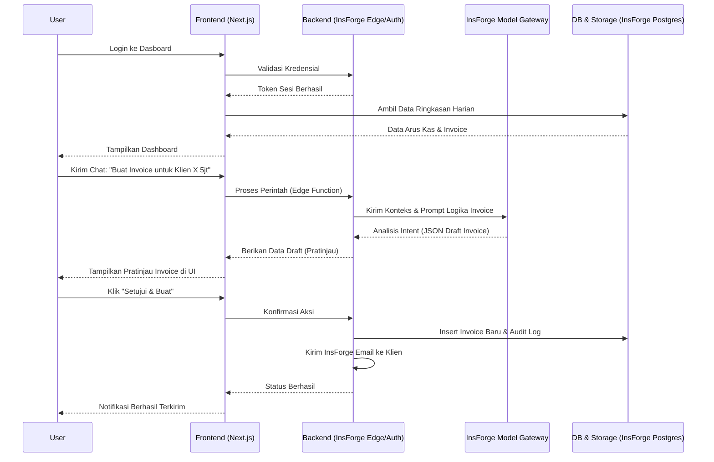
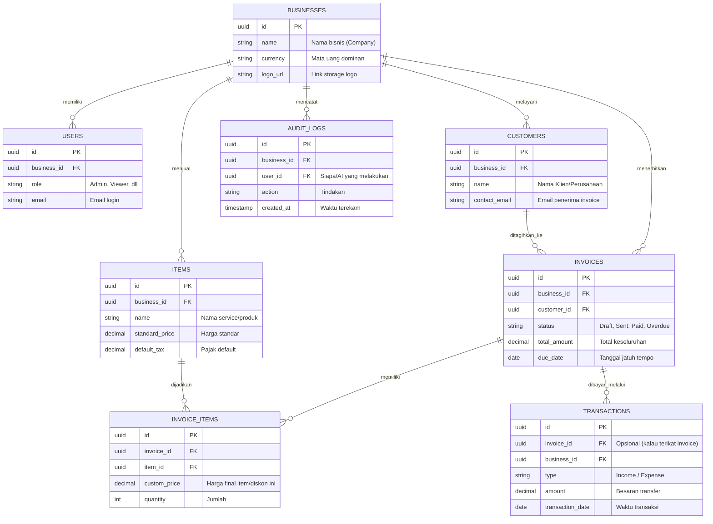

# PRD — Project Requirements Document

## 1. Overview
Saat ini, banyak bisnis B2B skala kecil dan menengah (seperti agensi, konsultan, dan pekerja lepas) masih mengelola administrasi keuangan dan penagihan menggunakan dokumen manual atau *spreadsheet* (seperti Excel). Proses ini memakan waktu dan berisiko memunculkan kesalahan. Aplikasi ini hadir sebagai solusi SaaS pintar berbasis *Artificial Intelligence* (AI) yang berfungsi layaknya asisten keuangan. Pengguna dapat mengelola *invoice*, melacak piutang, dan mencatat pengeluaran secara jauh lebih cepat cukup melalui percakapan (chat) dengan agen AI. Visi utamanya adalah mengubah tata kelola yang memakan waktu menjadi sangat efisien, cepat, dan aman melalui alur validasi *chat → draft → review → persetujuan → eksekusi*.

## 2. Requirements
- **Efisiensi Waktu & Penggunaan Natural**: AI diinisiasi sebagai titik interaksi utama sehingga pengguna bisa memberi perintah dengan bahasa sehari-hari.
- **Validasi Manusia di Tengah Proses (Human-in-the-loop)**: AI dilarang mengirim *invoice* atau mengubah data tanpa pratinjau dan persetujuan (konfirmasi) eksplisit dari pengguna.
- **Transisi Bebas dari Spreadsheet**: Menyediakan fitur dasar yang mencakup pembuatan tagihan, pelacakan kas, dan log transaksi pemasukan/pengeluaran agar target pengguna tidak perlu lagi membuka Excel.
- **Kemudahan Pemantauan Harian**: Dashboard instan berfokus pada ringkasan arus kas setiap harinya untuk membangun tingkat retensi aplikasi.
- **Akurasi Data**: AI harus menjawab dan mengambil kesimpulan berdasarkan data konkret di dalam *database* pengguna, bukan berhalusinasi.

## 3. Core Features
Fitur-fitur berikut disusun berdasarkan kerangka fitur (roadmap) yang telah disepakati untuk Fase 1:

- **Dashboard Ringkasan** [high] — Lihat sekilas arus kas, tagihan jatuh tempo, dan piutang terlambat dalam satu layar utama.
  - *Ringkasan Arus Kas*: Menampilkan total uang masuk dan keluar bulan ini.
  - *Tagihan Jatuh Tempo*: Daftar invoice yang harus segera dibayar pelanggan.
  - *Piutang Terlambat*: Daftar invoice yang sudah lewat jatuh tempo dan belum dibayar.
- **Obrolan AI** [high] — Ajukan perintah atau pertanyaan keuangan lewat chat, mulai dari buat invoice hingga cek piutang.
  - *Input Perintah*: Ketik atau kirim pesan untuk meminta AI melakukan tugas keuangan.
  - *Pratinjau Tindakan*: Lihat draf hasil kerja AI (misal, invoice) sebelum disetujui.
  - *Konfirmasi Eksekusi*: Tombol setuju, edit, atau tolak atas draf yang dibuat AI.
  - *Jawaban Berbasis Data*: AI menjawab pertanyaan ringkasan atau status keuangan berdasarkan data nyata.
- **Kelola Invoice** [high] — Lihat, setujui, dan lacak semua status invoice serta pengingat otomatis.
  - *Daftar Invoice*: Tampilan tabel semua invoice dengan status (lunas, pending, terlambat).
  - *Detail & Kirim Invoice*: Lihat detail invoice, setujui, dan langsung kirim ke pelanggan.
  - *Pengingat Otomatis*: Atur pengingat yang akan dikirim ke pelanggan untuk invoice yang belum dibayar.
- **Manajemen Pelanggan & Item** [medium] — Simpan daftar pelanggan, produk/jasa, pajak, dan diskon untuk mempercepat pembuatan invoice.
  - *Data Pelanggan*: Tambah, lihat, dan edit informasi kontak serta detail pelanggan.
  - *Katalog Item*: Simpan produk atau jasa lengkap dengan harga, pajak, dan diskon standar.
- **Keamanan & Audit** [medium] — Atur akses tim dan lacak semua perubahan data atau tindakan AI demi keamanan.
  - *Akses Berbasis Peran*: Tentukan siapa yang bisa membuat, menyetujui, atau hanya melihat data.
  - *Riwayat Audit*: Lihat log semua tindakan penting yang dilakukan pengguna dan AI.
- **Pintu Masuk & Akun** [medium] — Lindungi data dengan login dan kelola profil akun bisnis Anda.
  - *Daftar & Masuk*: Buat akun atau masuk ke aplikasi dengan email dan kata sandi.
  - *Kelola Profil*: Atur nama bisnis, logo, dan mata uang yang digunakan.

## 4. User Flow
1. **Pendaftaran dan Aktivasi**: Pengguna membuat akun, memasukkan info dasar profil berbisnis mereka (seperti nama bisnis dan mata uang).
2. **Pemantauan Harian**: Setelah masuk, pengguna mendarat di Dashboard Ringkasan. Mereka melihat ringkasan performa finansial seperti uang yang masuk dan *invoice* yang masuk daftar tunggu penagihan.
3. **Interaksi Obrolan AI (Tanya Data)**: Pengguna mengetik *"Invoice mana saja yang terlambat minggu ini?"*. AI menarik data dari *database* lokal dan menjabarkan rincian tersebut di area *chat*.
4. **Interaksi Obrolan AI (Tindakan)**: Pengguna menetapkan perintah *"Buatkan invoice untuk Klien Busa senilai Rp5 Juta untuk Jasa Audit bulanan"*.
5. **Human-in-the-loop**: Di layar *chat*, muncul kartu pratinjau (draft) *invoice*. Pengguna mengklik "Setuju & Buat".
6. **Eksekusi**: *Invoice* direkam dalam sistem. Pengguna memilih untuk mulai mengirim ke surel (*email*) pelanggan melalui aplikasi dengan satu klik, dan sistem mencatat semua proses tersebut dalam riwayat audit (Audit Log).

## 5. Architecture
Aplikasi ini dijalankan menggunakan pola *Client-Server* modern. Frontend mengelola tampilan secara dinamis dan meminta aksi terhadap Backend. Keamanan komunikasi dengan AI terjaga dengan menghubungkan *request* AI lewat fungsi di *backend* agar tidak mengekspos API eksternal. Akses otorisasi di-handler langsung oleh servis Backend Terpadu.

## 6. Database Schema
Kumpulan tabel berikut merepresentasikan relasi basis data antar entitas krusial. 

**Penjelasan Tabel Utama:**
1. **`businesses`**: Menyimpan data identitas operasional (tenant) dan konfigurasinya. Satu entitas berkolerasi dengan seluruh data miliknya secara isolatif.
2. **`users`**: Para anggota tim dari sebuah bisnis, berisi hak pengelolaan (*role*) dan email masuk.
3. **`customers`**: Database klien target yang menerima hasil _invoice_.
4. **`items`**: Katalog jasa dan produk yang disiapkan agar tidak perlu mengisi detail produk mentah-mentah dari nol saat mengobrol.
5. **`invoices` & `invoice_items`**: Rekam jejak *invoice* dan rincian transaksi belanja. Menyimpan indikator jumlah tagihan beserta kalkukasi dan kapan penagihan kedaluwarsa.
6. **`transactions`**: Untuk mencatat arus kas (keluar & masuk) agar kalkulasi *cash flow* pada *dashboard* akurat, fleksibel dipakai mencatat beban operasi (biaya iklan, dsb).
7. **`audit_logs`**: Mencatat semua jejak rekam mutasi data; sangat krusial untuk pelacakan apa saja yang diotak-atik AI bersama *Approval* anggota tim.

## 7. Tech Stack
Pengembangan aplikasi ini direkomendasikan memakai perpaduan teknologi *modern* untuk menopang ketangkasan. Karena **InsForge** ditetapkan sebagai fondasi BaaS inti, aplikasi ini akan memanfaatkan kapabilitas bawaannya tanpa *overlap* di layanan pihak ketiga.

- **Frontend**: Next.js (sebagai React *framework* utama yang merender UI dan *routes*).
- **Styling & UI Components**: Tailwind CSS dikombinasikan dengan shadcn/ui.
- **Backend & BaaS**: Ditenagai sepenuhnya oleh **InsForge** sebagai platform utuh yang memfasilitasi:
  - **Database**: PostgreSQL (relasional utuh dari InsForge).
  - **Authentication**: Email/Password, manajemen *session*, serta dukungan akses OAuth oleh InsForge Auth.
  - **File Storage**: InsForge Storage (misal untuk menyimpan *logo file* bisnis).
  - **Edge Functions**: Digunakan untuk validasi logika keamanan dan meneruskan pemrosesan parameter *chat* secara *server-side*.
  - **E-mails Service**: Penyuratan transaksional bawaan untuk pengiriman *invoice* ke pelanggan serta pemberitahuan.
  - **Realtime**: Kemampuan sinkronisasi antar klien (saat *invoice* lunas, *frontend* langsung dimutakhirkan).
- **AI Provider / Gateway**: **InsForge Model Gateway (OpenRouter)** digunakan sebagai agen AI utama untuk melakukan pemahamanan teks berbasis NPL yang diintegrasikan langsung menyatu dalam platform.
- **Deployment**: Seluruh layanan akan di-hosting secara langsung menggunakan kapabilitas *Deployment* dari InsForge.